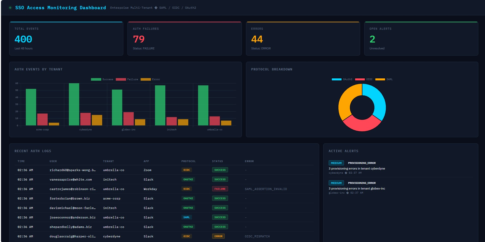
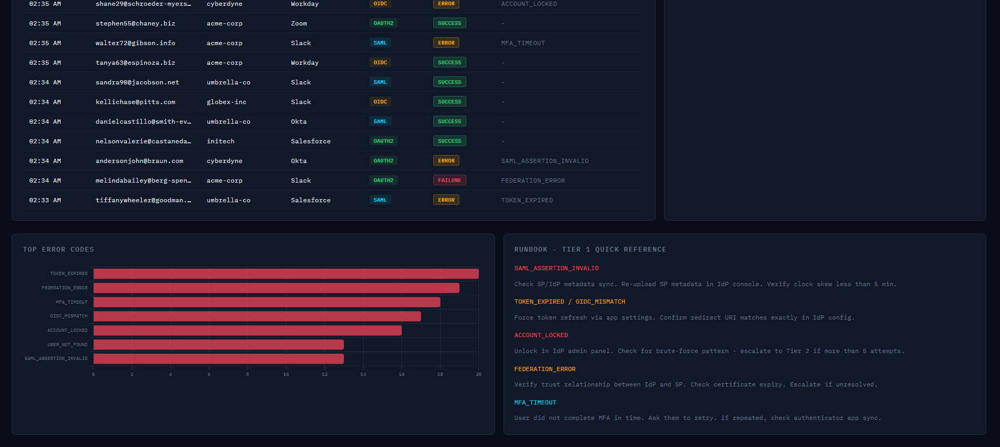

# Enterprise SSO & Access Monitoring Dashboard

A monitoring platform that ingests authentication logs from enterprise SaaS integrations and detects access failures, provisioning errors, and federation anomalies across a simulated multi-tenant environment.

## Screenshots

## Stack
- Backend: Python, Flask, SQLite
- Frontend: HTML/CSS/JS, Chart.js
- Testing: pytest (6 tests, 6 passing)
- Protocols Monitored: SAML, OIDC, OAuth2

## Features
- Real-time auth event ingestion across 5 simulated tenants
- SQL-based alerting rules detecting repeated failures, federation anomalies, provisioning errors
- REST API with 6 endpoints auto-refreshing every 15 seconds
- Tier 1 escalation runbook built into the dashboard
- 6 pytest unit tests covering all API endpoints

## Setup
1. python -m venv venv
2. venv\Scripts\activate
3. pip install -r backend/requirements.txt
4. cd backend
5. python ingestor.py
6. python alerting.py
7. python app.py
8. Open frontend/dashboard.html in your browser

## API Endpoints
- GET /api/stats - KPI summary
- GET /api/logs - Recent auth events
- GET /api/alerts - Active unresolved alerts
- GET /api/by-tenant - Events grouped by tenant
- GET /api/by-protocol - SAML/OIDC/OAuth2 breakdown
- GET /api/error-codes - Top error codes ranked
